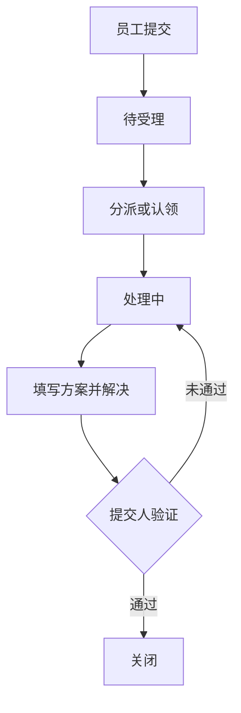

# 产品需求说明（PRD）

## 1. 背景与目标

企业员工通过口头、群聊或私信报障时，容易出现遗漏、责任不清、进度不可追踪和高频问题难以复盘。TicketScope 提供统一入口，将“提交—分派—处理—验证—关闭”结构化，并用 SLA 与看板帮助团队识别风险。

目标：统一问题入口、明确责任和时限、保留处理轨迹、支持数据分析与报表导出。

## 2. 用户与权限

| 角色 | 用户目标 | 主要功能 |
|---|---|---|
| 普通员工 | 快速提交并跟踪本人问题 | 创建、查看、关闭/重开本人工单 |
| 技术人员 | 管理本人待办 | 认领、处理、填写方案、解决 |
| 管理员 | 管理全局服务质量 | 分派、推进流程、SLA 升级、全局看板和导出 |

## 3. 核心流程

## 4. 功能需求

### 4.1 登录与权限

- 用户使用邮箱和密码登录，成功后获取限时签名令牌。
- 所有业务接口验证令牌；页面只展示当前角色允许的操作。
- 普通员工仅访问本人数据，技术人员访问本人负责项及可认领队列，管理员访问全部数据。

### 4.2 工单管理

- 标题、描述、部门、类型和优先级必填。
- 支持编号/标题/描述搜索，按状态、优先级、部门、类型和 SLA 状态筛选。
- 服务端校验状态机；解决时必须填写解决方案。
- 记录创建、编辑、状态变更和升级的操作人、时间与备注。

### 4.3 SLA

| 优先级 | SLA | 预警阈值 |
|---|---:|---:|
| 低 | 72 小时 | 最后 18 小时 |
| 中 | 48 小时 | 最后 12 小时 |
| 高 | 24 小时 | 最后 6 小时 |
| 紧急 | 8 小时 | 最后 2 小时 |

- 活跃工单展示正常、临期或超时。
- 已完成工单展示达标或违约。
- 管理员可将超时工单升级至 L1、L2、L3。

### 4.4 看板与报表

- 总数、解决率、平均处理时长、SLA 达标率、临期、超时和升级数量。
- 近 30 天新建/解决趋势及状态、优先级、部门、类型分布。
- 看板和导出均遵守角色数据范围。
- 根据当前筛选条件导出 UTF-8 CSV 或格式化 Excel。

## 5. 非功能需求

- 前后端双层权限控制，密码仅保存哈希。
- 统一 JSON 错误结构，关键业务规则有自动化测试。
- 中文界面支持桌面和窄屏浏览。
- 本地开发一条命令启动后端；提供生产 WSGI 与容器部署配置。

## 6. 验收标准

1. 三类账号均可登录，错误密码被拒绝。
2. 各角色只能查看并操作权限范围内的数据。
3. 非法状态跳转、无负责人进入处理、无解决方案完成均被后端拦截。
4. SLA 状态、看板汇总与明细数据一致。
5. 超时工单可升级并产生操作日志。
6. 筛选结果可导出为 CSV 和 Excel。
7. 自动化测试、前端生产构建与生产模式健康检查通过。

