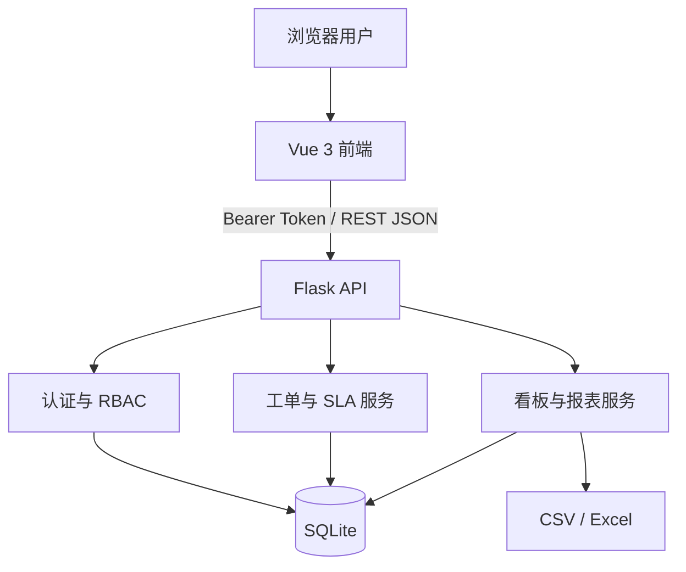
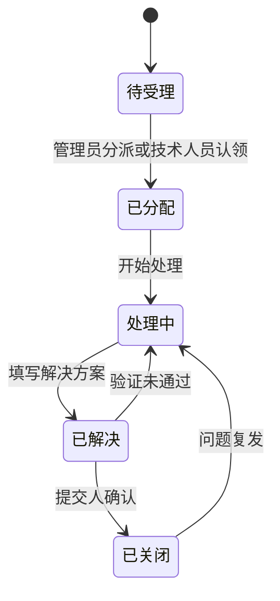
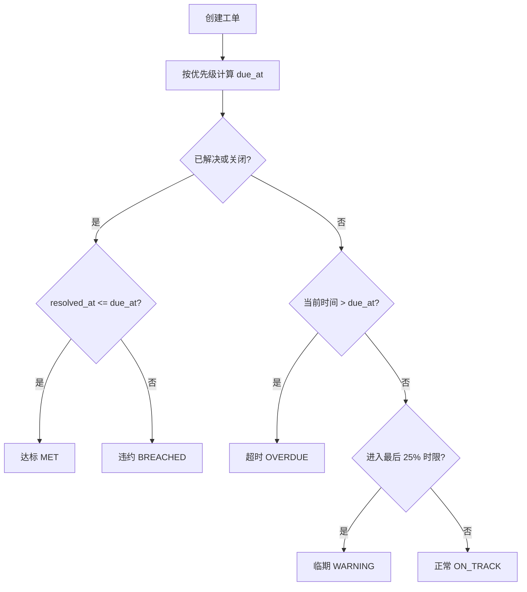

# 系统架构设计

## 总体架构

- Vue 负责登录、列表筛选、处理表单、运营看板和导出交互。
- Flask 负责认证、数据范围、状态机、SLA 计算和接口校验。
- SQLite 保存用户、工单及不可覆盖的操作日志；在生产环境可替换为 PostgreSQL。
- Gunicorn 作为生产 WSGI 服务，Docker 或 Render 负责运行环境。

## 权限与数据范围

| 角色 | 可见数据 | 核心权限 |
|---|---|---|
| 普通员工 | 自己提交的工单 | 新建、查看、确认关闭、重新打开 |
| 技术人员 | 自己负责的工单和未分配待受理队列 | 认领、开始处理、填写方案、解决 |
| 管理员 | 全部工单 | 分派、全流程处理、超时升级、全局看板 |

权限同时在前端控制按钮显示、在后端校验接口与数据范围；后端校验才是最终安全边界。

## 状态机

状态规则由后端统一维护，避免仅通过页面按钮限制而被绕过。

## SLA 计算

## 关键设计取舍

1. 签名令牌适合无复杂账号体系的作品集演示；真实系统应接入企业 SSO/OIDC。
2. SQLite 便于零配置演示；并发写入和高可用场景应改用 PostgreSQL/MySQL。
3. SLA 在查询时实时计算，保证展示准确；大规模场景可通过定时任务预计算并发送通知。
4. 日志表追加写入，保留状态变化、操作人和备注，支持问题复盘与审计。

