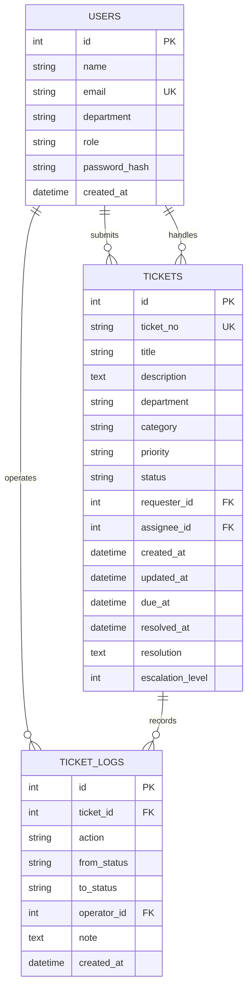

# 数据库设计

## 表职责

- `users`：保存演示用户、角色和密码哈希；邮箱唯一。
- `tickets`：保存工单当前快照；提交人必填，负责人可在待受理阶段为空。
- `ticket_logs`：追加记录创建、更新、状态变化和 SLA 升级，不覆盖历史。

## 完整性与性能

- 状态、优先级和角色使用 `CHECK` 约束。
- 外键维护用户、工单和日志关系；删除工单时级联删除其日志。
- 状态、优先级、部门、类型、创建时间及日志工单 ID 建立索引。
- 时间统一保存为 UTC ISO 8601 字符串，前端本地化展示。
- 启动时执行轻量迁移，为旧演示库补充 `password_hash` 和 `escalation_level`。

## 生产化方向

- 使用 PostgreSQL/MySQL 与正式迁移工具代替 SQLite 和启动时迁移。
- 采用 SSO/OIDC，并增加刷新令牌、账户停用和安全审计。
- 为工单编号使用数据库序列，避免高并发编号冲突。
- 为日志增加请求 ID、IP、字段级差异和不可篡改存储策略。

