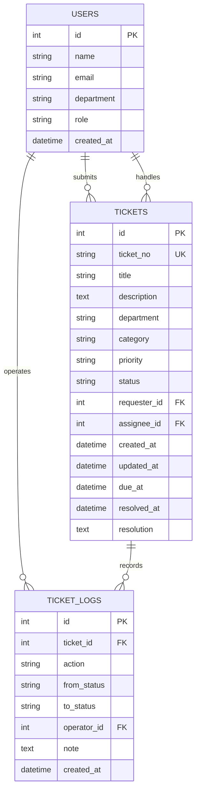

# 数据库设计

## ER关系

## 设计说明

- `users`同时保存提交人、技术人员和管理员，通过`role`区分。
- `tickets.requester_id`不能为空，`assignee_id`在待受理阶段可以为空。
- 工单状态和优先级使用数据库CHECK约束，防止写入无效值。
- `ticket_logs`不覆盖历史数据，用于重建工单处理过程。
- 日期统一保存为UTC ISO 8601文本，前端按本地时区展示。
- 常用筛选字段建立索引，包括状态、优先级、部门、类型和创建时间。

## 生产环境改进

- 将SQLite替换为MySQL或PostgreSQL。
- 为用户表增加企业身份系统标识，而不是保存演示用户。
- 为日志增加请求ID、IP和字段级变更内容。
- 为工单编号使用数据库序列或独立编号服务，避免高并发冲突。

